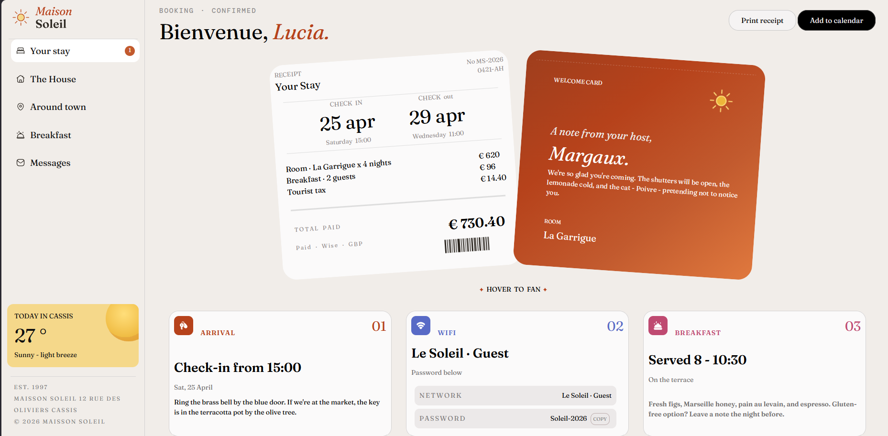

# Frontend Mentor - Hotel Booking Confirmation Page

This is my solution to the Hotel Booking Confirmation Page challenge on Frontend Mentor. The goal was to recreate the provided design as accurately as possible while keeping the layout responsive across different screen sizes.

## Overview

### Original Design

### My Solution

### Links

- Live Site: https://fm-hotel-booking-confirmation.netlify.app/
- Repository: https://github.com/fatihkeleess/frontend-mentor/tree/main/hotel-booking-confirmation

## Built with

- Semantic HTML5
- CSS Custom Properties
- Flexbox
- CSS Grid
- BEM Methodology
- JavaScript
- Responsive Design

## What I learned

During this project, I improved my understanding of CSS Grid, Flexbox, responsive layouts, and BEM naming conventions. I also learned the importance of accessibility by adding focus states and accessible labels for icon-only buttons.

## Continued development

In future projects, I want to improve my CSS architecture, learn more about responsive typography using `clamp()`, and build better accessibility habits from the start.

## Useful resources

- Frontend Mentor
- MDN Web Docs